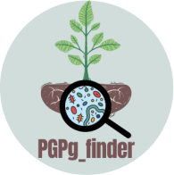

# PGPg_finder

PGPg Finder is a versatile command-line tool designed for the annotation of Plant-Growth Promotion Traits (PGPT) in both genomes and metagenomes. Rooted in the comprehensive PLant-associated BActeria web resource database (PLaBAse), this tool boasts flexibility and user-friendliness. PGPg Finder offers a range of pre-configured workflows, enabling users to select the tools and processes best suited to their specific research needs.


# Features
The pipeline allows you to choose from several workflows based on the tools and steps you need. The workflows currently available are:

## Genome Analysis
**genome_wf**: A genome annotation pipeline that uses Prodigal for gene prediction and DiAMOND against PLaBAse.

## Metagenome Analysis
meta_wf: A metagenome workflow with megahit assembly, Prodigal gene prediction, DIAMOND annotation, Bowtie2 mapping, samtools quantification.  

**metafast_wf**: A metagenome workflow with PEAR assembly and direct DIAMOND annotation.


Each workflow is designed to be run with a specific set of input files and produces a set of output files. The tool also supports running on multiple threads to improve performance.


# Installation:

To use the tool, you first need to clone the repository and ensure that all dependencies are installed.
```bash
git clone https://github.com/tpellegrinetti/PGPg_finder/
```
After this procedure, you need to performe the installation of dependancies with conda (recomended).
The conda will create a separated environment called PGPb_finder.
```bash
bash install.sh
```
If conda not work for you, you can install the dependences mannualy without a separeted environment and run PGPb_finder (not recomended).

# Usage:

if you want to learn how to use the PGPg_finder, click the link below:

[Tutorial](https://github.com/tpellegrinetti/PGPg_finder/blob/main/Tutorial.md)


You can run the PGPg_finder tool using the following command:

`python PGPb_finder.py -w workflow -i input_directory -o output_directory -t threads`

the -a argument is optional and works if you want to provide assembly files


1) Running PGPb_finder with genomes:

`python PGPb_finder.py -w genome_wf -i /path/to/fasta/folder/ -o /path/to/your/desired/out/ -t 12`


2) Running PGPb_finder with metagenomes:
 
a) Fast way (less accurated)

`python PGPb_finder.py -w metafast_wf -i /path/to/fasta/folder -o /path/to/your/desired/out/ -t 12`

b) Slow way (more accurated) 

`python PGPb_finder.py -w meta_wf -i /path/to/fasta/folder -o /path/to/your/desired/out/ -t 12`

Here you can provide your metagenome assemblies with -a option

### For help with the arguments, you can use the command python PGPb_finder -h. ###

# Dependencies
This tool depends on the following libraries and tools:

* Python 3.7.12
* Bash
* Trimmomatic==0.39
* pear==0.9.6
* Diamond==2.0.14
* Megahit==1.2.9
* Prodigal==2.6.3
* Bowtie2=2.3.5.1
* BBmap==39.01
* Samtools==1.17
* Seaborn==0.12.2
* Scipy==1.7.3
* gawk==5.1.0
* matplotlib==3.3.2
* numpy==1.21.6
* pandas=1.3.5  

# Database PLaBAse
Moreover, this pipeline was developed based on a curated database called "PLant-associated BActeria web resource (PLaBAse)".
Acess PLaBAse website: https://plabase.cs.uni-tuebingen.de/

We encourage you to cite the PLaBAse:

Patz S, Rauh M, Gautam A, Huson DH. mgPGPT: Metagenomic analysis of plant growth-promoting traits.(submitted, 2024, preprint)
Patz S, Gautam A, Becker M, Ruppel S, Rodríguez-Palenzuela P, Huson DH. PLaBAse: A comprehensive web resource for analyzing the plant growth-promoting potential of plant-associated bacteria. (submitted 2021, preprint)

If PGPb_finder was useful for you please cite us:

Pellegrinetti, TA; Monteiro, G; Lemos, LN; Tsai, SM; Mendes, L. PGP_finder: PGPg_finder: A Comprehensive and User-friendly Pipeline for Identifying Plant Growth-Promoting Genes in Genomic and Metagenomic Data. 
